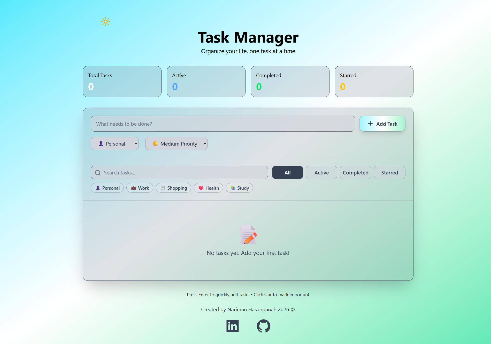
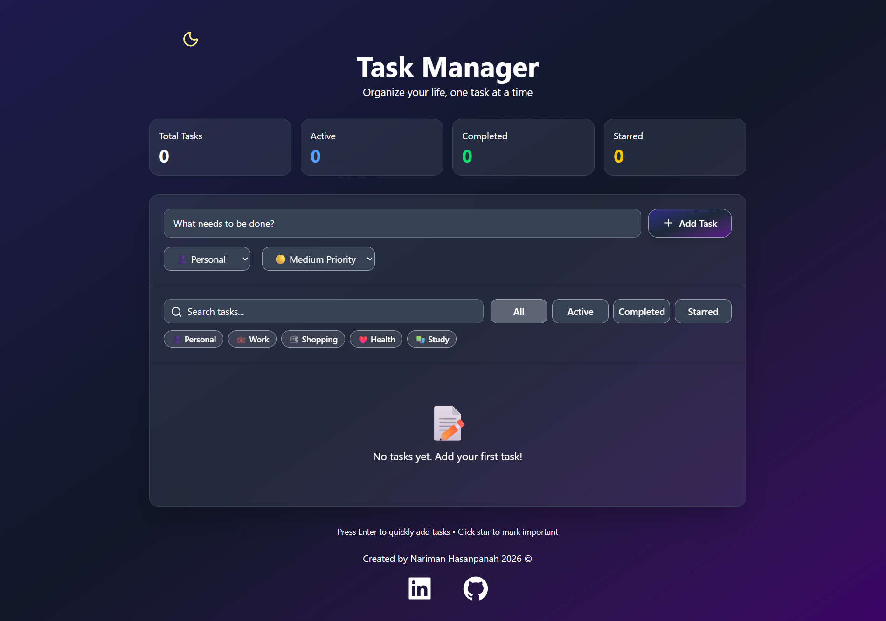

<div align="center">

# ✅ Task Manager

A modern and responsive Task Management application built with React and Vite.

Organize your daily tasks with categories, priorities, search, filters, dark mode, and persistent storage using LocalStorage.

</div>

---

## ⚡️ Tech Stack

- ⚛️ React (Vite)
- 🎨 Tailwind CSS
- 💾 LocalStorage
- 🧠 Context API
- 🧩 Component-Based Architecture
- 📦 JavaScript (ES6+)

---

## ✨ Features

- ✅ Add new tasks
- 🗑 Delete tasks
- ✔️ Mark tasks as completed
- ⭐ Star / Unstar tasks
- 🔍 Search tasks
- 🗂 Filter by status
- 📁 Filter by category
- 🚩 Priority levels (High, Medium, Low)
- 📊 Task statistics
- 🌙 Dark / Light mode
- 💾 Persistent data with LocalStorage
- 📱 Fully responsive design

---

## 📸 Preview

<div align="center">

### Home Page (Light Mode)



### Home Page (Dark Mode)



</div>

---

## 🚀 Live Demo

*نکته مهم برای اجرای دمو : این پروژه از Cloudflare Pages استفاده میکنه که ممکنه از داخل ایران بدون VPN در دسترس نباشد.پس برای مشاهده صحیح پروژه(چه آنلاین و چه لوکال) لطفا حتما VPN خود را روشن نگه دارید.

### 👉 [View Live Project](https://todo-app-eru.pages.dev/)

---

## ⚙️ Installation

git clone https://github.com/Nariman-Hasanpanah/todo-app.git

cd todo-app

npm install

npm run dev

---

## 📚 What I Learned

- React Fundamentals
- Component-Based Architecture
- State Management with useState
- Side Effects with useEffect
- Controlled Components
- Lifting State Up
- Props & Component Communication
- Array Methods (map, filter)
- LocalStorage
- JSON.stringify() & JSON.parse()
- Conditional Rendering
- Reusable Components
- Utility Functions
- Dark Mode implementation with Tailwind CSS

---

## 📁 Project Structure

```
src
│
│
├── components
│   ├── Header
│   ├── AddTask
│   ├── SearchBar
│   ├── FilterBar
│   ├── TaskList
│   ├── TaskItem
│   └── StatsBar
│
├── context
│   ├── ThemeContext.jsx
│   └── ThemeProvider.jsx
│
├── data
│   ├── categories.jsx
│   └── filters.jsx
│
├── utils
│   ├── taskHandlers.jsx
│   └── getPriorityColor.jsx
│
├── App.jsx
└── main.jsx
```
---

## 👨‍💻 Author

Nariman Hasanpanah

- GitHub: https://github.com/Nariman-Hasanpanah
- LinkedIn: https://www.linkedin.com/in/nariman-hasan-panah-7b1897308

---

## ⭐️ Support

If you like this project, don't forget to give it a ⭐️ on GitHub.

Thank you ❤️